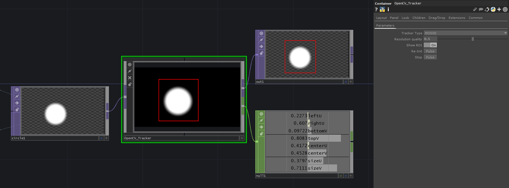

# TD-OpenCV-Tracker
TouchDesigner component, which allows to track objects in selected ROI (Region Of Interest)

# Overview

# Parameters

* **Tracker type** - (Menu) Tracker type (https://learnopencv.com/object-tracking-using-opencv-cpp-python/)
* **Resolution quality** - (Float) Size of the processed image
* **Show ROI** - (Toggle) Show/hide ROI rectangle
* **Re-init** - (Pulse) Re-initialize tracking
* **Stop** - (Pulse) Stop tracking

# Notes

- Support starts from Build 2021.10330
